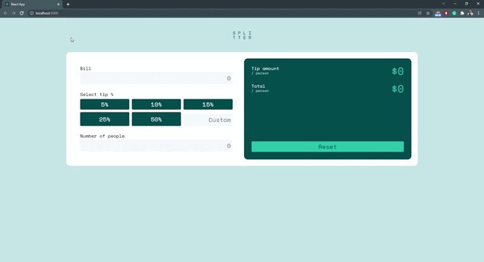

# Tip and  bill calculator

## Project Description

This is small project, where you can calculate tip and bill amount for 1 person. You can use this app on computer and mobile phone.

Project was made with React framework!

 

## To run my project:

Start with:

### `npm install`

To install all necessary contents dependencies

### `npm start`

Runs the app in the development mode.\
Open [http://localhost:3000](http://localhost:3000) to view it in the browser.

### `npm test`

Launches the test runner in the interactive watch mode.

### `npm run build`

Builds the app for production to the `build` folder.\
It correctly bundles React in production mode and optimizes the build for the best performance.

 

Hope you enjoy,
Toms 
